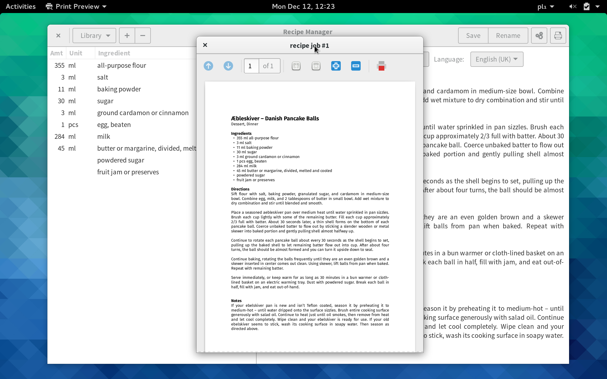

- This is a recipe manager program, written in Gtk+ and Vala.
- Supports smart unit conversion, will automatically find the most reasonable conversion, given a measuring system, e.g. in customary metric 8 tbsp ≈ ½ cup
- Allows for recipe localisation (can read customary units in supported locales -- currently en_GB, en_US and pl_PL)
- Supports Unicode fractions in order to nicely render customary units
- Allows for printing/exporting recipes to PDF
- Published under GNU General Public License v3.0.

## Screenshots

