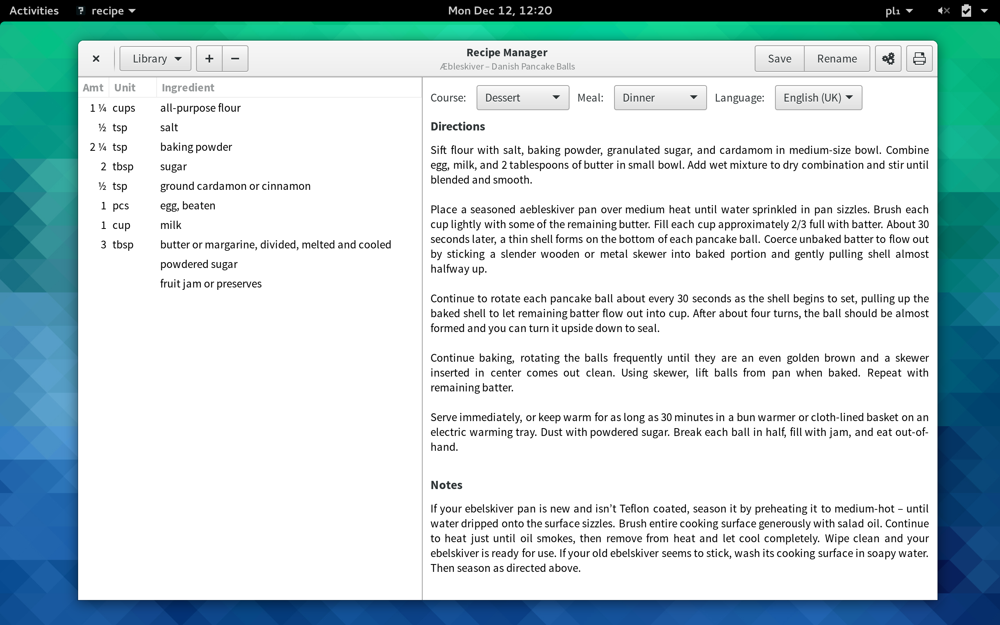
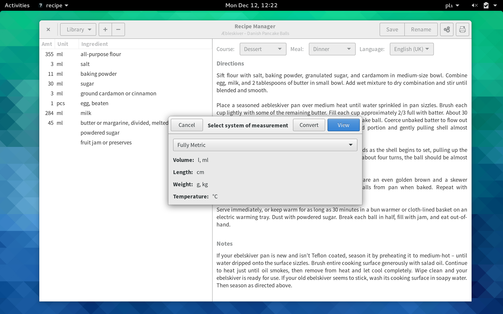

# What is it?

This is a recipe manager application for Linux, written in Gtk+ and Vala.

## But why?

I love cooking. Sometimes you find a very good recipe, and you want to store it – this is what this application is for. It's simple and easy to use, but at the sime time has all the functionality you need.

## Unit conversion

Aren't you annoyed when you find a nice recipe and it has weird units in it? The built in unit conversion functionality will convert the units to the measuring system you're familiar with, and it will do it intelligently. Because if you learn that ¼ pint in the US is equal to 118 ml it doesn't really help that much, does it? However if I say it's approximately ½ cup it probably makes more sense.

## Localisation

Recipe Manager allows for recipe localisation. Currently the UI is only in English, however the units and printouts can be localised. Currently the app can read customary units in supported locales: en_GB, en_US and pl_PL, however it's easy to add new locales in `recipe-manager-conf.json`. If you extend it, please [let me know!](mailto:szymonlopaciuk@protonmail.ch)

## Other stuff

- Supports Unicode fractions in order to nicely render customary units
- Allows for printing/exporting recipes to PDF
- Published under GNU General Public License v3.0

## Screenshots

